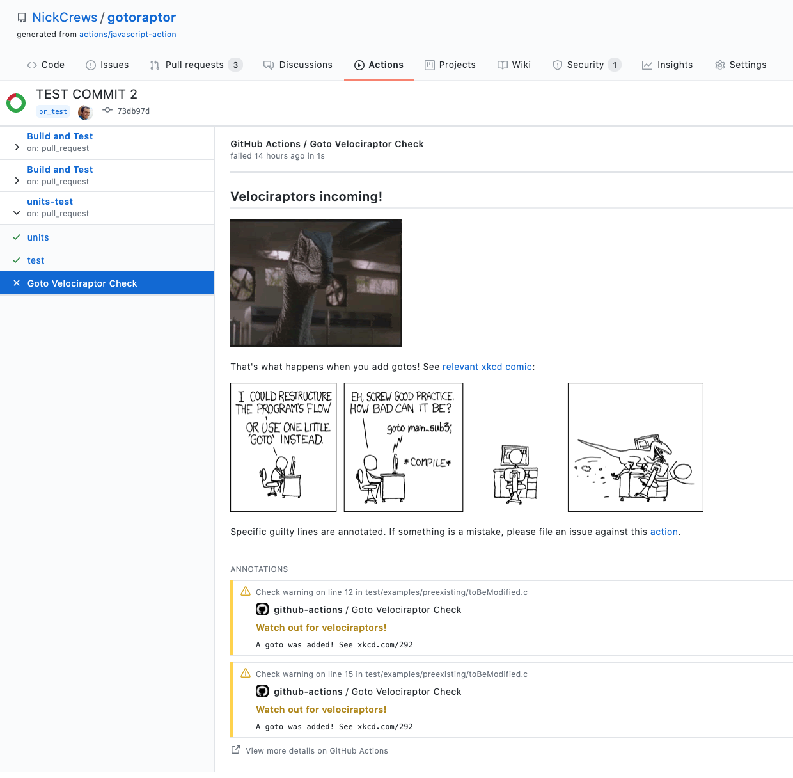

# GoTo Velociraptor Check


So you thought no one would notice that one little `goto` you added? Watch out!
This action is always watching, and will send velociraptors to anyone is
foolish enough to try to sneak one in. Inspired by the [xkcd comic *goto*](https://xkcd.com/292):

<p align="center">
  <a href="https://xkcd.com/292">
    
  </a>
</p>

## Usage

You can use the action by adding this step to your project's
[workflow yaml](https://docs.github.com/actions/quickstart):

```yaml
name: Lint
on: [pull_request, push]
jobs:
    name: Goto Velociraptor Check
    steps:
      # Checking out the repo is NOT required
      # - uses: actions/checkout@v2
      - uses: NickCrews/gotoraptor@v1
```

If the action finds any gotos were added, then the PR or push commit gets
flagged. Of note are the velociraptor memes, the xckd comic, and annotations
on specific lines:



See the [actions tab](https://github.com/NickCrews/gotoraptor/actions) for example runs of this action! :rocket:
